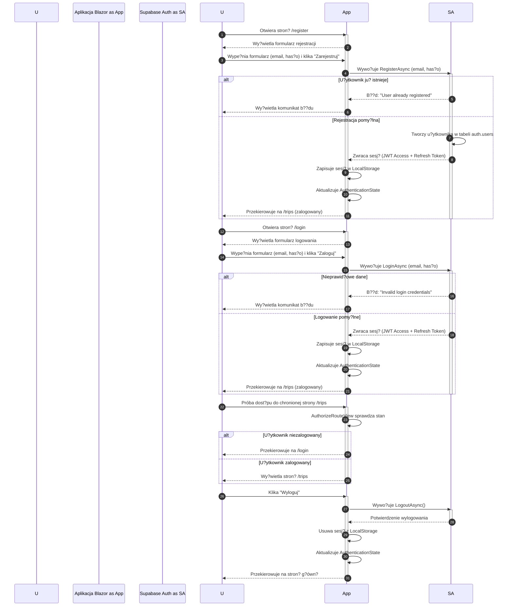

<authentication_analysis>
1.  **Przep?ywy autentykacji**:
    *   **Rejestracja**: U?ytkownik podaje e-mail i has?o. Aplikacja Blazor wywo?uje `AuthService.RegisterAsync`, który korzysta z `supabase.Auth.SignUp()`. Po pomy?lnej operacji, Supabase tworzy nowego u?ytkownika i automatycznie go loguje, zwracaj?c sesj?.
    *   **Logowanie**: U?ytkownik podaje e-mail i has?o. Aplikacja Blazor wywo?uje `AuthService.LoginAsync`, który u?ywa `supabase.Auth.SignInWithPassword()`. Supabase weryfikuje dane i zwraca sesj? (tokeny JWT). Sesja jest zarz?dzana przez klienta Supabase, który przechowuje j? w `LocalStorage`.
    *   **Zarz?dzanie sesj? i stanem**: `CustomAuthenticationStateProvider` zarz?dza stanem uwierzytelnienia w aplikacji. Metoda `GetAuthenticationStateAsync` sprawdza `client.Auth.CurrentUser`. Stan jest propagowany przez `CascadingAuthenticationState`, a komponenty `AuthorizeView` i atrybut `[Authorize]` chroni? trasy i komponenty.
    *   **Od?wie?anie tokenu**: Klient Supabase C# automatycznie zarz?dza od?wie?aniem tokenu dost?powego, u?ywaj?c tokenu od?wie?aj?cego, gdy ten pierwszy wygasa.
    *   **Wylogowanie**: U?ytkownik klika przycisk "Wyloguj". Wywo?ywana jest metoda `AuthService.LogoutAsync`, która wykonuje `supabase.Auth.SignOut()`, uniewa?niaj?c sesj? po stronie klienta.
    *   **Resetowanie has?a**: U?ytkownik prosi o reset has?a, co wywo?uje wys?anie linku przez Supabase. Nast?pnie u?ytkownik ustawia nowe has?o za pomoc? tokenu z linku.

2.  **G?ówni aktorzy i ich interakcje**:
    *   **U?ytkownik (Przegl?darka)**: Interakcja z interfejsem u?ytkownika aplikacji Blazor.
    *   **Aplikacja Blazor (WASM)**: Aplikacja kliencka dzia?aj?ca w przegl?darce, zawieraj?ca komponenty UI, serwisy (`AuthService`) i logik? zarz?dzania stanem.
    *   **Supabase Auth**: Us?uga backendowa odpowiedzialna za tworzenie u?ytkowników, uwierzytelnianie, zarz?dzanie sesjami i bezpiecze?stwo na poziomie wierszy (RLS).

3.  **Procesy weryfikacji i od?wie?ania tokenów**:
    *   **Weryfikacja**: Przy ka?dym ??daniu do chronionego zasobu, `CustomAuthenticationStateProvider` sprawdza wa?no?? sesji. Polityki RLS w Supabase dodatkowo weryfikuj? token JWT przy dost?pie do danych, zapewniaj?c, ?e u?ytkownicy widz? tylko swoje dane (`auth.uid()`).
    *   **Od?wie?anie**: Gdy token dost?powy wygasa, biblioteka kliencka Supabase automatycznie wysy?a ??danie do punktu ko?cowego `/token` z tokenem od?wie?aj?cym, aby uzyska? now? par? tokenów bez konieczno?ci ponownego logowania przez u?ytkownika.

4.  **Krótki opis kroków autentykacji**:
    *   **Rejestracja**: U?ytkownik -> Formularz Rejestracji -> `AuthService` -> `Supabase Auth.SignUp()` -> Utworzenie u?ytkownika i sesji.
    *   **Logowanie**: U?ytkownik -> Formularz Logowania -> `AuthService` -> `Supabase Auth.SignIn()` -> Weryfikacja i zwrot sesji.
    *   **Dost?p do chronionej strony**: U?ytkownik -> Próba dost?pu -> `AuthorizeRouteView` -> Sprawdzenie stanu w `CustomAuthenticationStateProvider` -> Zezwolenie lub przekierowanie na `/login`.
    *   **Wylogowanie**: U?ytkownik -> Przycisk "Wyloguj" -> `AuthService` -> `Supabase Auth.SignOut()` -> Usuni?cie sesji z `LocalStorage`.
</authentication_analysis>

<mermaid_diagram>

</mermaid_diagram>
